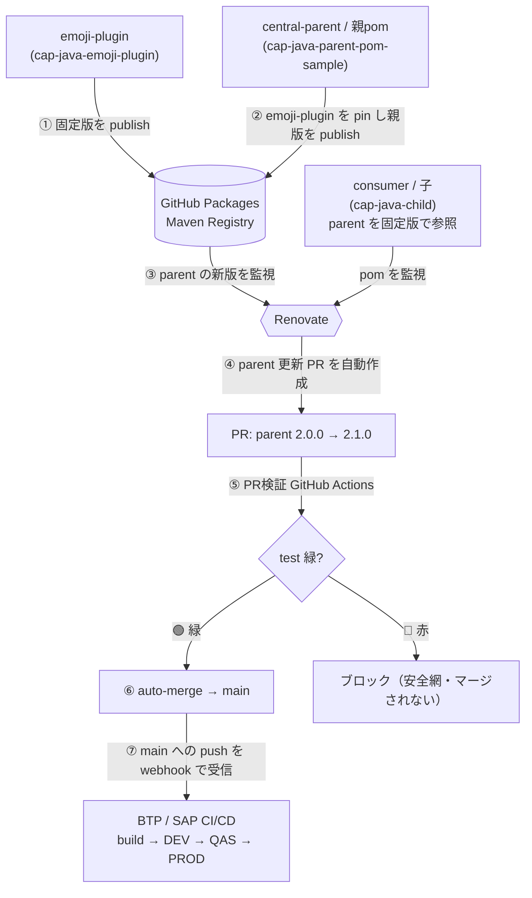

# consumer-a（CAP Java）

中央の共有ライブラリ（emoji-plugin）の版上げを、**手動確認なしで安全に自動ロールアウト**する「昇格モデル」の consumer 側サンプル。

親pom（`central-parent`）が依存版を一元管理し、その版上げを **Renovate が検知 → PR 自動作成 → PR で自動テスト → 緑なら auto-merge → main への push で CI/CD 起動**、という連鎖で取り込む。consumer 側の自動テストが「壊れていないこと」の自動検証（安全網）を担う。

## 関連リポジトリ

| リポジトリ | 役割 | GitHub Packages に publish |
|---|---|---|
| **[cap-java-parent-pom-sample](https://github.com/miyasuta/cap-java-parent-pom-sample)** | 親pom（`central-parent`）。依存版を一元管理し固定版でリリース | `com.example.central:central-parent` |
| [cap-java-emoji-plugin](https://github.com/miyasuta/cap-java-emoji-plugin) | 検証対象の共有ライブラリ（`emoji-plugin`） | `com.example.cap.plugins:emoji-plugin` |
| [cap-java-child](https://github.com/miyasuta/cap-java-child)（本リポジトリ） | consumer。`<parent>` で central-parent を固定版参照 | — |

## 主要な設定箇所

| 設定 | 場所 | 役割 |
|---|---|---|
| 親pom の固定版参照 | [pom.xml](pom.xml) `<parent>` | Renovate が版上げを検知・更新する対象 |
| Renovate 設定 | [renovate.json](renovate.json) | 取得先（GitHub Packages）・認証・`automerge` |
| PR 自動テスト | [.github/workflows/pr-test.yml](.github/workflows/pr-test.yml) | PR で `mvn test` を実行しステータスを返す |
| GitHub Packages 解決 | [settings.xml](settings.xml) | 親pom・プラグインの取得先と認証（ビルド時） |
| 安全網テスト | [srv/src/test/java/customer/consumer_a/EmojiPluginITest.java](srv/src/test/java/customer/consumer_a/EmojiPluginITest.java) | プラグインの契約（絵文字付与）が生きているか検証 |

GitHub 側の設定（ファイル外）：

- **ブランチ保護**：main に必須チェック `test`（緑まで待たせる）
- **Allow auto-merge**：Settings → General → Pull Requests
- **シークレット**：Actions `GH_PACKAGES_PAT`（CI ビルド用）／ Mend `GITHUB_PACKAGES_TOKEN`（Renovate 用）。いずれも `read:packages`

> 「緑は自動マージ／赤はブロック」は **Renovate `automerge:true` ＋ Allow auto-merge ＋ 必須チェック `test`** の3点セットで成立する。

## ドキュメント

1. **土台**：[docs/guide/GUIDE-central-build-setup.md](docs/guide/GUIDE-central-build-setup.md) — 親pom 中央ビルドの構成（親 / 子 / GitHub Packages / CI/CD、settings.xml・PAT 解決）
2. **自動化**：[docs/guide/GUIDE-promotion-model.md](docs/guide/GUIDE-promotion-model.md) — ①の上に Renovate＋PR検証＋auto-merge を載せて版上げを自動展開。動作確認（赤→緑）も
- 背景・設計判断・移行ステップ：[docs/plan/PLAN-promotion-model.md](docs/plan/PLAN-promotion-model.md)
